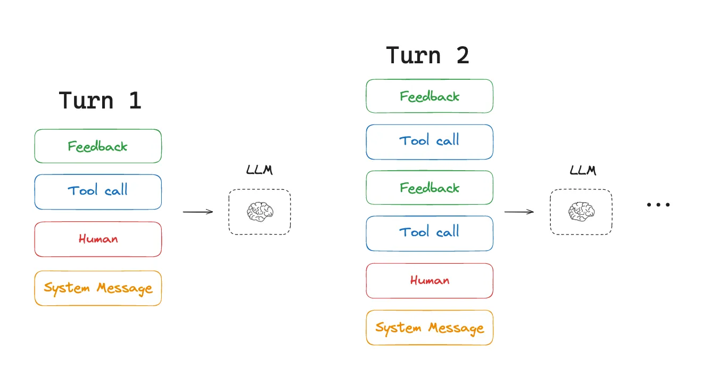
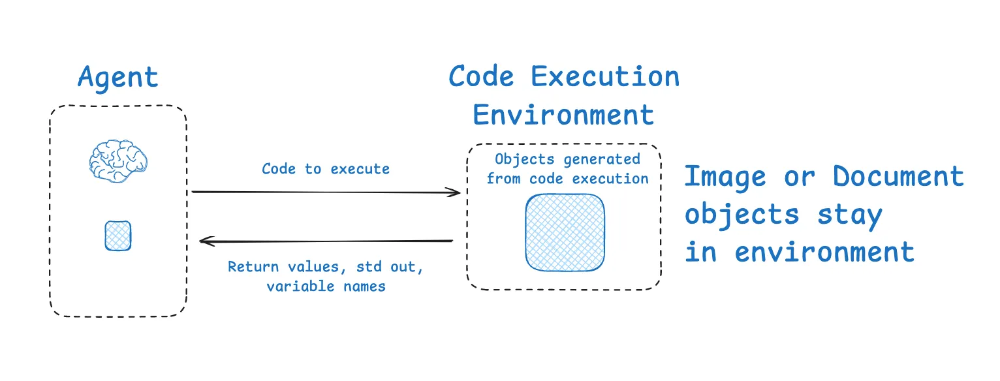

By 2025, existing models have already become remarkably intelligent. However, even the smartest system cannot perform effectively without understanding what it is being asked to do. **Prompr engineering** refers to the practice of phrasing tasks in an optimal way for large language model-based chatbots. **Context engineering**, on the other hand, represents the next stage - aiming to automate this process within dynamic systems.

## What is Context Engineering?

<p>
  <a href="https://x.com/tobi/status/1935533422589399127" target="_blank" rel="noopener">Tobi</a>, from Shopify, shared an interesting post in which he expressed his appreciation for the term “Context Engineering.” 
  Later, <a href="https://x.com/karpathy/status/1937902205765607626" target="_blank" rel="noopener">Karpathy</a> followed up with a brilliant definition:
</p>

> Context engineering is the art and science of filling the context window with just the right information at each step of an agent’s trajectory

<a href="https://www.youtube.com/watch?v=LCEmiRjPEtQ" target="_blank" rel="noopener">Karpathy</a> made a powerful analogy: he compared LLMs to a computer's CPU, and the context window to RAM. Just like memory is always limmited, and operating system decides what should be loaded into RAM to keep the  system running effectivly. Similarly, the goal of context engineering is to determine what information should be placed into the limited context window at each step of the LLM's reasoning process. 


### Types of Context Engineering

**Context Engineering** is an <a href="https://x.com/dexhorthy/status/1933283008863482067" target="_blank" rel="noopener">umbrella discipline</a> that encompasses several types of contextual inputs:

- **Instructions**: Commonly referred to as "prompts", these specify what the AI should do.
- **Knowledge**: Facts and data retrieved from external files or databases.
- **Memories**: Previous converstaion history or reference examples that provide continuity.
- **Tools**: Information about which tools that AI can use (e.g., calculator, search engine) and the results returned by these tools.


### Why Is This Harder for Agents?

There are two man reasons why context engineering becomes more challenging for agents:

1. **Agents typically handle longer-running or more complex tasks.**
2. **Agents extensively use tool calling.**


Both characterstics lead to **increased context load**. For example, in multi-turn tasks, each tool call's feedback gets written to the context window. The first round calls one tool, the second calls another tool... As the number of rounds increases, the accumulated tool feedback in the context grows continuously, consuming significant tokens.



[Drew Breunig](https://www.dbreunig.com/2025/06/22/how-contexts-fail-and-how-to-fix-them.html) provides an excellent summary of context failures in his blog post, including:

- **Context Poisoning**: Malicious or misleading information injected into the context.

- **Context Distraction**: Irrelevant information that diverts attention from the main task.

- **Context Confusion/Curation Errors**: Poor organization or conflicting information.

- **Context Clash**: Contradictory information that creates confusion.

As context length grows, models must process more information, increasing the likelihood of errors: they may become confused due to information conflicts or be misled by injected hallucinations, producing incorrect responses. As Cognition recently emphasized in a blog post:

> Context Engineering is effectively the #1 job of engineers building AI agents.

### Approaches

[Lance](https://rlancemartin.github.io/2025/06/23/context_engineering/)在blog post中提到，上下文工程的策略大致可以归纳为四类：

- Writing Context: 将信息保存在上下文窗口之外，以辅助智能体完成任务。
- Selecting Context: 有选择地拉取上下文信息进入上下文窗口，辅助任务执行。
- Compressing Context: 保留最相关的 tokens，丢弃冗余或无关内容，以节省上下文空间。
- Isolating Context: 将上下文进行分段或模块化处理，以减少信息干扰、提升任务清晰度。


## Writing Context

Writing Context 的核心思想是：把信息保存在 AI 的“短期记忆”（即上下文窗口）之外，让它在需要的时候可以随时读取和参考。
这就像我们人类在处理复杂问题时的做法一样。我们会做两件事：记笔记和形成记忆。对应到智能体，也可以做这两件事：
- 记笔记 -> 使用 “暂存区” (Scratchpad)
- 形成记忆 -> 使用 “长期记忆” (Memory)

**Scratchpad：临时笔记**

当 Agent 正在执行一个具体的、单一的任务时，它可以把中间过程的想法、计划或关键信息写到这个暂存区里，供稍后自己查阅。

Example：[Anthropic’s multi-agent researcher](https://www.anthropic.com/engineering/built-multi-agent-research-system)

> The LeadResearcher begins by thinking through the approach and saving its plan to Memory to persist the context, since if the context window exceeds 200,000 tokens it will be truncated and it is important to retain the plan. 

技术实现方式：
- 把草稿保存到一个文件中（例如 JSON、TXT）
- 将它保存到一个运行时的 state 对象（如 LangGraph 的 state）中

核心理念：**让智能体“边做边写”，并在需要时查阅它刚刚写的内容**;一旦当前任务完成，暂存区里的内容通常也就不再需要了。


**Memories：多次对话的经验**

Memory 则不同，它用来存放那些希望Agent 能在多次、不同的对话或任务中都能记住的信息。它更像是Agent积累的“经验”。

Example:

- [Generative Agents](https://ar5iv.labs.arxiv.org/html/2304.03442)：通过过去交互的反馈，自动合成“记忆块”
- [ChatGPT 的记忆功能](https://help.openai.com/en/articles/8590148-memory-faq)：自动记录用户喜好、语气、常用信息
- [Cursor](https://forum.cursor.com/t/0-51-memories-feature/98509) & [Windsurf](https://docs.windsurf.com/windsurf/cascade/memories)：根据用户行为自动生成记忆，用于上下文补全

Agent 在和你的互动中产生了新的信息，它不断接收到新的上下文，也不断动态更新记忆库. 新的信息可以合并到旧的记忆中，形成一个更完整的“个性化背景”。


## Selecting Context

在Writing Context 中，我们把信息存了起来。现在，Selecting Context 要解决的问题是：如何从海量的信息中，挑出当前最需要的那一部分，然后放进 Agent 有限的“工作记忆”里。

Agent 可以选择它自己刚刚“写入”暂存区的内容，但这只是最基本的操作。更有趣、也更微妙的是从“长期记忆”中进行选择。为了更好地理解，我们可以类比一下人类的记忆类型：

|Memory Type| What is Stored | Human Example |Agent Example|
|---|---|---|---|
|Semantic | Facts | Things I learned in school. | Facts about a user|
|Episodic | Experiences | Things I did. | Past agent actions | 
|Procedural | Instructions | Instincts or motor skills. | Agent system prompt | 

这些记忆类型可以通过不同方式拉入上下文窗口，帮助智能体解决特定类型的问题。

### 实际应用场景

**1. Instructions**

指令或程序记忆通常被记录在规则文件中，比如使用代码智能体时的 CLAUDE.md 文件。这通常是一个包含风格指南或特定项目工具使用通用指令的文件。很多时候，这些内容会被全部拉入上下文中。例如，当你启动 Claude Code 时，它会拉入你项目和组织中的文件。

**2. Facts**

当信息库非常庞大时（比如全公司的文档、所有的历史邮件），我们必须精准地只挑出与当前问题相关的事实。例如企业内部知识库问答，常用技术有2种：

- Embedding-based Similarity Search： 把所有文档都转换成数学向量，当用户提问时，系统会去寻找“意思上”最相近的文档片段。
- Graph Databases： 把信息和它们之间的关系存成一张图，可以进行更复杂的逻辑查询。

**3. Tools**

Agent 在使用多个工具时，如果不加选择地加载所有工具描述，会造成性能下降;有[研究表明](https://arxiv.org/abs/2505.03275)，当工具数量超过 30 个时，LLM 开始性能下降，100 个时几乎完全失效. 因此提出了在工具描述上使用RAG技术。

对每一个工具的描述进行处理，就像处理知识库文档一样。当任务需要时（比如用户说“帮我看看明天北京天气怎么样”），系统会先通过语义搜索，在所有工具中发现“查询天气”这个工具与任务最相关。然后，它只把这一个被“选择”出来的工具的使用说明放进上下文。

**4. Knowledge**

RAG是一个庞大的话题，你可以将记忆视为RAG的一个子集，但RAG的范围当然要广泛得多。

例子：CodiumAI 的代码检索策略

[Windsurf 的 CEO Varun](https://x.com/_mohansolo?ref_src=twsrc%5Etfw%7Ctwcamp%5Etweetembed%7Ctwterm%5E1899630246862966837%7Ctwgr%5Efb30cffd54a1c3d0097bdc5472f1ace48bfd0fb5%7Ctwcon%5Es2_&ref_url=https%3A%2F%2Fwww.notion.so%2FContext-Engineering-for-Agents-22e785c1c51f80db8d6dc19ebbc9edbc) 曾分享过他们是如何为编程助手做知识选择的,他们的流程非常精细：

- Smart Chunking：他们不是随机地把代码切成一块块，而是沿着代码的语义边界（比如一个完整的函数、一个类）进行切分，保证了检索到的上下文是完整的。

- Hybrid Search：他们发现，单纯依赖向量搜索有时并不可靠。因此，他们会结合使用多种技术，比如传统的关键字搜索（grep）、知识图谱，以及向量搜索。

- LLM-based Re-ranking：从上述所有渠道检索到一堆候选代码片段后，他们会再用一个 LLM 对这些结果进行打分和排序，挑出最优的一个或几个，最后才把这个“精选”出的结果放入最终的上下文窗口。

从这个例子可以看出，Selecting Context 是一个经过层层优化的、高度工程化的过程。

## Compressing Context

当我们已经写入并选择了信息后，有时会发现，即使是精挑细选出来的内容，也还是太长了，上下文窗口依然放不下。这时，就需要Compressing Context。

Compressing Context的核心是：只保留执行任务所必需的 Tokens（文本单元），去除冗余信息。

### Summarization

总结是上下文压缩中最常见的方式，可以应用在不同范围和时机上：

**1. 对整个对话进行摘要**

这是一种“兜底”策略，防止对话过长导致系统崩溃。

Example：[Claude Code “auto compact”](https://docs.anthropic.com/en/docs/claude-code/costs)

当你在和 Claude 的代码助手进行长时间对话，快要接近它 20 万 Tokens 的上下文窗口上限时（达到 95%），它会自动触发一个叫“auto compact”的功能。这个功能会把你们之前的整个对话历史进行一次总结，用一段更简短的摘要来代替冗长的原文，从而释放出空间。

**2. 对特定部分进行摘要**

这是一种更巧妙的方法，不在最后时刻才压缩全部内容，而是在过程中对特定部分进行精准压缩。

* **Completed work sections**
  
  在 AnthropicAI的文章 [How we built our multi-agent research system](https://www.anthropic.com/engineering/built-multi-agent-research-system)当一个子任务或一个研究部分完成后，系统只会对这个已完成的部分进行摘要。这样做既保留了这部分工作的结论，又避免了其冗长的过程细节占据宝贵的上下文空间。

* **Passing context to linear sub-agents**

  [Cognition的post Don’t Build Multi-Agents](https://cognition.ai/blog/dont-build-multi-agents)提到agent在处理复杂任务时，把任务分解给不同的子代理。这时，摘要就成了一种信息交接的方式。当主代理把任务交给子代理 1 时，它不会把所有原始上下文都传过去，而是先生成一个摘要，子代理 1 只需要读取这个压缩后的精简版上下文，就能理解任务并开始工作。

  

  ### Trimming

  除了生成摘要，还有一种更直接的压缩方式叫“修剪”。它不是重写内容，而是选择性地直接删除那些我们认为不那么重要的 Tokens。

  - **Heuristics:** 这是最简单的方法。比如，我们可以设定一个简单的规则：“只保留最近的 10 轮对话”，直接丢弃更早的记录。
  - **Learned Pruning:** 我们可以利用另一个（通常是更小更快的）LLM 模型，让它来判断上下文中的哪些部分与当前任务关系不大，然后将它们“修剪”掉。

## Isolating Context

Isolating Context 的核心思想是：将上下文划分成多个独立部分，让每个 agent 或任务模块只处理自己需要的那一块上下文，从而提升效率和可扩展性。这种方法对于处理极其复杂的任务尤其有效。

### Multi-Agent Systems

我们不再依赖一个“全能”的 Agent，而是组建一个“Agent 团队”，每个成员都有自己独立的**上下文窗口、工具和指令**，各司其职:

**1. OpenAI Swarm library**

框架的设计是基于[separation of concerns](https://openai.github.io/openai-agents-python/ref/agent/)。一个复杂的任务被分解，分配给团队里不同的 AI 代理，每个代理都在自己的独立的上下文窗口里工作，互不打扰。

**2. Anthropic Multi-Agent Research System**

[Anthropic的研究](https://www.anthropic.com/engineering/built-multi-agent-research-system)中把这一点阐述得更明确。他们让多个子代理并行工作，每个代理都有自己的上下文窗口，去同时探索同一个问题的不同方面。

>  Subagents facilitate compression by operating in parallel with their own context windows, exploring different aspects of the question simultaneously before condensing the most important tokens for the lead research agent. 


这带来的最大好处是：极大地扩展了整个系统能够处理的信息总量。每个代理都有自己独立的上下文窗口，系统总的处理能力不再受限于单个模型的窗口大小。一个代理可以深入研究子主题 A，另一个代理深入研究子主题 B，最后将各自的研究成果汇总，就能生成一份内容更丰富、更深入的报告。


### Sandboxed Execution

这种方法是将 AI 的“思考”和“执行”隔离开。

**[HuggingFace 的 Open Deep Research](https://huggingface.co/blog/open-deep-research#:~:text=From%20building%20,it%20can%20still%20use%20it)**



1. Agent 负责生成一段包含它想运行的工具和逻辑的代码。
2. 这段代码在一个隔离的“沙盒”环境中被执行。
3. 沙盒环境可以处理各种“重资产”，比如加载大型文件、图片或音频，这些东西非常消耗 Tokens，但它们始终停留在沙盒里，从未进入过 LLM 的上下文窗口。
4. 沙盒执行完毕后，只把最关键、最简洁的结果（比如一个计算结果、一个文件路径、一个状态变量）选择性地传递回 LLM，供它进行下一步的“思考”。

这个方法的精妙之处在于，沙盒可以跨越多轮对话持续保持状态。这意味着你不必在每一轮交互中都把所有东西重新加载进 LLM 的上下文，极大地节省了成本和 Tokens，实现了对 Token 密集型对象和 LLM 上下文的完美隔离。

### Runtime State Objects

这是一种在代码层面实现隔离的、非常直观的方法。

**[Models-Pydantic](https://docs.pydantic.dev/latest/concepts/models/)**

我们可以创建一个专门用于管理状态的数据模型（比如 Python 中的 Pydantic 模型）。这个模型可以有很多个字段，你可以把每个字段想象成一个独立的“桶”。

- 可以把对话历史放进“历史桶”。
- 可以把从数据库检索到的文件内容放进“文件桶”。
- 可以把工具的输出结果放进“工具结果桶”。

```Py
class AgentState(BaseModel):
    user_goal: str                       # The user's task goal
    plan_summary: str                    # Summary of the current plan
    tool_outputs: Dict[str, Any]         # Tool output bucket
    recent_messages: List[str]           # History bucket (dialogue history)
    retrieved_files: Dict[str, str]      # File bucket (retrieved document contents)
```

在 Agent 运行的任何阶段，你都可以根据需要，决定要从哪个“桶”里捞出哪些信息，然后组合起来传递给 LLM。

